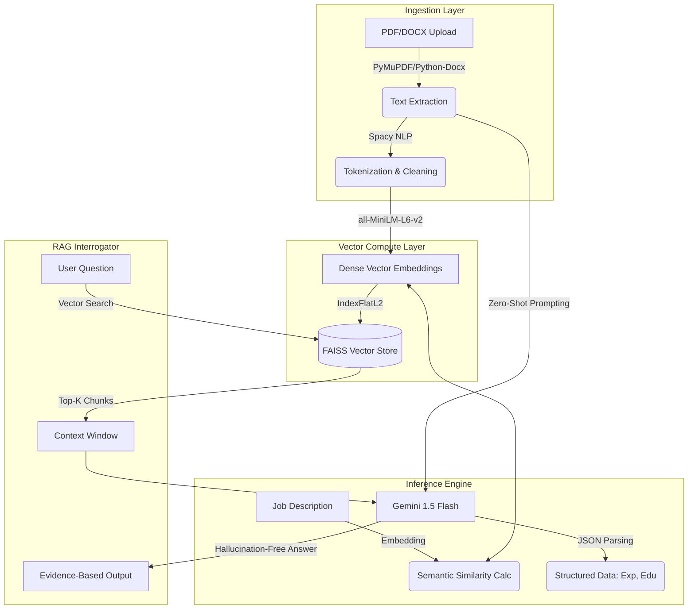

# 🧬 Enterprise AI Talent Platform
### *High-Dimensional Semantic Resume Analysis & RAG Orchestration Engine*

[](https://streamlit.io/)
[](https://www.python.org/)
[](https://deepmind.google/technologies/gemini/)
[](https://github.com/facebookresearch/faiss)
[](https://huggingface.co/)
[](https://containers.dev/)

**The Enterprise AI Talent Platform** is not just a resume parser—it is a sophisticated **RAG (Retrieval-Augmented Generation)** system. By projecting candidate profiles and job descriptions into a shared high-dimensional latent space, it performs semantic alignment far superior to traditional keyword matching. It features an interactive **AI Interrogator** that allows recruiters to "chat" with resumes to verify claims using evidence-based vector retrieval.

---

## 🏗️ System Architecture

The solution implements a **Multi-Stage Reasoning Pipeline** fusing deterministic logic with probabilistic Generative AI.



---

## 🧠 Core Intelligence Modules

### 1. High-Dimensional Semantic Matching (Cosine Similarity)
Traditional parsers fail on context. We utilize **Sentence Transformers (`all-MiniLM-L6-v2`)** to encode text into **384-dimensional vectors**.
*   **The Math:** We calculate the cosine similarity between the Job Description vector ($V_{JD}$) and Candidate vector ($V_{Cand}$).
    $$ \text{Score} = \frac{V_{JD} \cdot V_{Cand}}{\|V_{JD}\| \|V_{Cand}\|} $$
*   **Result:** Matches candidates who describe the *concept* of "Scalable Cloud Architecture" even if they don't explicitly say "AWS".

### 2. Retrieval-Augmented Generation (RAG)
We implemented a **FAISS (Facebook AI Similarity Search)** index for real-time candidate interrogation.
*   **Chunking Strategy:** Resumes are split into 300-word sliding windows with 50-word overlap to preserve context boundaries.
*   **Vector Search:** When a user asks *"Did they use Python in a production environment?"*, the system retrieves the nearest neighbor vectors to the query.
*   **Grounded Answer:** These vectors are injected into the Gemini context window, forcing the LLM to answer **only** based on retrieved evidence, eliminating hallucinations.

### 3. Weighted Ensemble Scoring Algorithm
Final ranking is not arbitrary. It is a deterministic weighted sum of four distinct analytical axes:
*   $\alpha$ **(40%) Semantic Alignment:** Vector space proximity.
*   $\beta$ **(30%) Hard Skill Overlap:** Regex-based exact matching against `SKILLS_DB`.
*   $\gamma$ **(20%) Experience Normalization:** LLM-extracted years vs. Requirements.
*   $\delta$ **(10%) Education Hierarchy:** Weighted mapping (PhD > Master's > Bachelor's).

---

## 🛠️ Technical Stack & Engineering Decisions

| Domain | Technology | Engineering Rationale |
| :--- | :--- | :--- |
| **LLM Orchestration** | `Google Gemini 1.5 Flash` | Selected for high throughput and massive context window (1M tokens) for handling verbose CVs. |
| **Vector Database** | `FAISS-CPU` | In-memory vector search optimized for dense vectors; faster than pinecone/chroma for session-based indexing. |
| **Embeddings** | `Sentence-Transformers` | Uses `all-MiniLM-L6-v2` for the optimal balance of inference speed and semantic capture quality. |
| **UI/State** | `Streamlit` | Utilizes `@st.cache_resource` to keep heavy ML models (Spacy/Transformers) in memory, ensuring sub-second reruns. |
| **Environment** | `DevContainers` | Full infrastructure-as-code. Pre-configured with Python 3.11 and system-level dependencies (build-essential) for FAISS. |

---

## ⚡ Deployment & Infrastructure

### 🐳 The Dockerized Workflow (DevContainer)
This project is built for **Codespaces** and **Remote Containers**. Zero "it works on my machine" issues.

1.  **System Dependencies:** The `devcontainer.json` automatically runs `apt update` and installs system libraries required for `fitz` (PyMuPDF) and `faiss`.
2.  **Port Forwarding:** Auto-configures port `8501` for instant preview.
3.  **Extension Pack:** Pre-loads `ms-python` and `pylance` for immediate intellisense.

### 🚀 Local Setup (Standard)

```bash
# 1. Clone the repository
git clone https://github.com/yourusername/ai-semantic-candidate-matcher.git

# 2. Initialize Virtual Environment
python -m venv venv
source venv/bin/activate

# 3. Install the AI Stack
pip install -r requirements.txt

# 4. Download NLP Artifacts
python -m spacy download en_core_web_sm

# 5. Configure Secrets
# Create .streamlit/secrets.toml and add:
# GOOGLE_API_KEY = "your_key_here"

# 6. Launch Application
streamlit run streamlit_app.py
```

---

## 📂 Project Directory Structure

```text
ai-semantic-candidate-matcher/
├── .devcontainer/             # 🐳 Infrastructure as Code
│   └── devcontainer.json      # Docker & VS Code Config
├── .streamlit/                # 🔐 App Configuration
│   └── secrets.toml           # API Keys (GitIgnored)
├── src/                       # (Optional) Module separation
├── streamlit_app.py           # 🚀 Main Application Kernel
├── requirements.txt           # 📦 Pinned Production Dependencies
└── README.md                  # 📄 System Documentation
```

---

## 🔮 Future Engineering Roadmap

*   **GraphRAG Integration:** Move beyond vector similarity to Knowledge Graph extraction for mapping candidate relationships (e.g., "Worked at Google" -> implies "High Scalability Experience").
*   **Multi-Modal Analysis:** Use Gemini Pro Vision to analyze graphical resume elements (charts, portfolio thumbnails).
*   **Asynchronous Processing:** Implement Celery/Redis for batch processing of 1000+ resumes.

---

<div align="center">

**[View Source Code](https://github.com/syedsalma2003/ai-semantic-candidate-matcher)** | **[Report Bug](https://github.com/syedsalma2003/ai-semantic-candidate-matcher/issues)**

<sub>Engineered with precision. Powered by Mathematics & Transformers.</sub>
</div>
