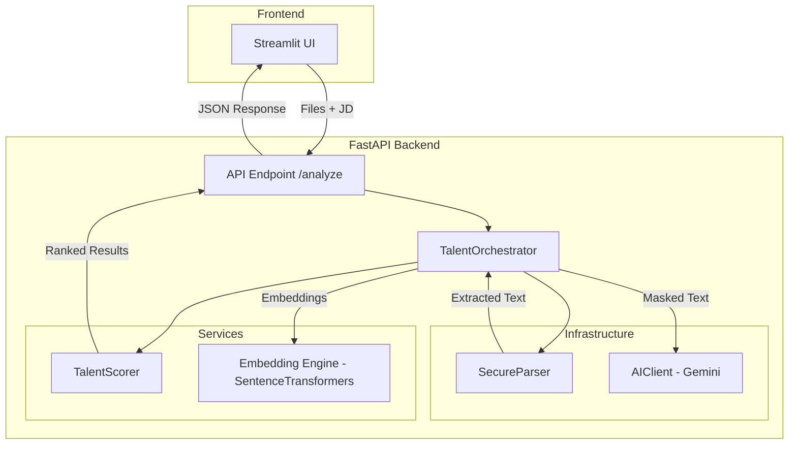

# AI Semantic Candidate Matcher

An AI-assisted application for ranking resumes against a job description using semantic similarity and structured resume analysis. 

Recruiters often receive hundreds of resumes for a single opening. Traditional keyword matching often fails when candidates use different terminology for the same skills. This tool solves that by using **Sentence Embeddings** for semantic matching and **Google Gemini** for structured experience extraction.

---

## Architecture

The system follows a modular, layered architecture to ensure separation of concerns and scalability.

### System Diagram


### Component Breakdown
*   **Streamlit UI**: A user-friendly interface for uploading PDF/DOCX files and inputting job descriptions.
*   **FastAPI API**: The gateway that handles requests, file validation, and response formatting.
*   **TalentOrchestrator**: The "brain" of the application that coordinates data flow between the parser, the AI client, and the scoring engine.
*   **SecureParser**: Extracts text from documents and scrubs Personally Identifiable Information (PII) like emails and phone numbers before processing.
*   **AIClient**: Interfaces with Google Gemini to perform high-level analysis and extract structured experience data.
*   **TalentScorer**: Calculates the final ranking using a weighted combination of semantic embeddings and experience normalization.

---

##  Features

- **Multi-Format Parsing**: Supports PDF and DOCX resumes using PyMuPDF and python-docx.
- **MIME Validation**: Ensures only valid document types are processed.
- **PII Scrubbing**: Automatically masks email addresses and phone numbers before sending data to the LLM for privacy.
- **AI Analysis**: Uses Google Gemini to extract structured candidate information and generate summaries.
- **Semantic Matching**: Leverages `all-MiniLM-L6-v2` Sentence Transformers for deep contextual understanding.
- **Weighted Scoring**: Configurable logic that combines cosine similarity with years of experience.
- **Containerized**: Fully Dockerized for easy deployment via Docker Compose.

---

## Technologies

| Category | Technology |
| :--- | :--- |
| **Language** | Python 3.10+ |
| **Backend** | FastAPI |
| **Frontend** | Streamlit |
| **LLM** | Google Gemini |
| **Embeddings** | Sentence Transformers (`all-MiniLM-L6-v2`) |
| **Parsing** | PyMuPDF, python-docx |
| **Validation** | Pydantic & Pydantic Settings |
| **Vector Math** | NumPy |
| **Deployment** | Docker / Docker Compose |

---

##  Project Structure

```text
src/
├── api/             # FastAPI endpoints and request handling
├── core/            # Configuration (Pydantic Settings) and Schemas
├── infra/           # Gemini client, Document parsers, and External utilities
├── services/        # Orchestration logic and Scoring engines
└── utils/           # Logging and PII scrubbing helpers

streamlit_app.py     # Frontend application
requirements.txt     # Python dependencies
docker-compose.yml   # Multi-container configuration
```

---

##  Getting Started

### 1. Clone the Repository
```bash
git clone https://github.com/SalmaTech-03/AI-semantic-candidate-matcher.git
cd AI-semantic-candidate-matcher
```

### 2. Configuration
Create a `.env` file in the root directory:
```env
GEMINI_API_KEY=your_google_gemini_api_key_here
```

### 3. Run with Docker (Recommended)
```bash
docker-compose up --build
```
*   Frontend: `http://localhost:8501`
*   Backend API: `http://localhost:8000`

### 4. Manual Installation
**Install Dependencies:**
```bash
pip install -r requirements.txt
```
**Start Backend:**
```bash
uvicorn src.api.main:app --reload
```
**Start Frontend:**
```bash
streamlit run streamlit_app.py
```

---

## Scoring Logic

The application calculates an **Overall Score** using the following formula:

$$Score = (SemanticMatch \times W_1) + (ExperienceAlignment \times W_2)$$

*   **Semantic Match**: Cosine similarity between the job description and the resume text.
*   **Experience Alignment**: Extracted years of experience normalized against a 5-year benchmark.
*   **Weights ($W$):** Configurable in `src/core/config.py`.

---

##  API Reference

### `POST /analyze`
Analyzes resumes against a job description.

**Form Data:**
- `jd`: (string) The job description text.
- `files`: (List of files) PDF or DOCX resume files.

**Example Response:**
```json
[
  {
    "name": "john_doe_resume.pdf",
    "score": 87.5,
    "details": {
      "overall_score": 87.5,
      "semantic_match": 90.3,
      "experience_alignment": 84.7,
      "reasoning": "Candidate shows 5+ years of experience in React and FastAPI."
    },
    "summary": "Experienced full-stack developer with strong background in Python..."
  }
]
```

---

##  Limitations & Future Roadmap

**Current Limitations:**
- Sequential resume processing (non-batched).
- Fixed 5-year experience benchmark.
- Manual JSON parsing of AI responses.
- No persistent database or authentication.

**Future Improvements:**
- [ ] Add automated unit and integration tests.
- [ ] Implement parallel processing for faster resume analysis.
- [ ] Use Pydantic structured parsing for Gemini responses.
- [ ] Add GitHub Actions for CI/CD.
- [ ] Implement batch embedding generation.

---

## 🤝 Contributing
Issues and pull requests are welcome. Please ensure that:
1. Business logic remains within the `services` package.
2. New features are documented.
3. The layered architecture is respected.
